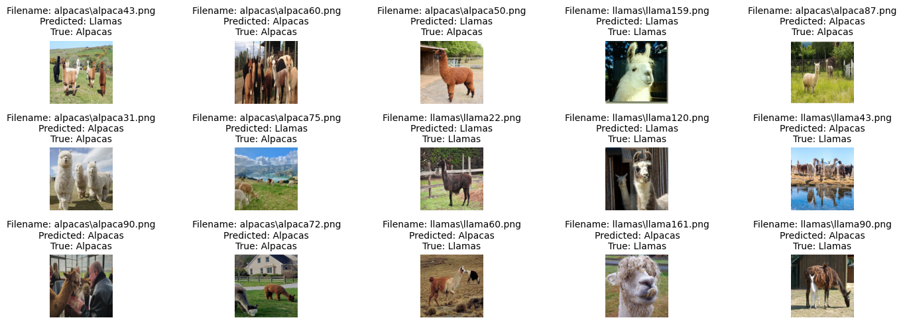

# LLama-vs-Alpaca

AI(CNN) that can differentiate Llamas from Alpacas

While humans can spot the differences between dogs and cats, they can't do the same with alpacas and llamas.
In a recent pool made on my instagram, 70% of the respondents said that they can't tell the difference between the two animals.

In this project a CNN was implemented and tested with pictures of alpacas and llamas reaching a 69.23% accuracy with the baseline model, superior than humans.

## Highlights

- Collected and labeled multiple photos of llamas and alpacas
- Built a CNN architecture to differentiate images from alpacas and llamas using Keras and Tensorflow
- Achieved 69.23% accuracy on test dataset

## Lessons Learned
[Lessons Learned Llama vs.Alpaca](https://github.com/marinalenza/LLama-vs-Alpaca/blob/main/doc/Lessons_Learned.MD)
